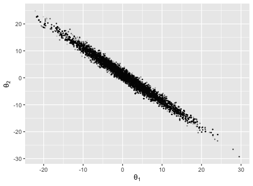
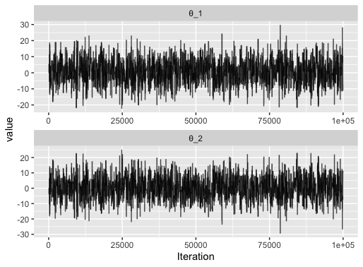

--- 
title: "ilike documentation"
author: "Richard G. Everitt"
date: "`r Sys.Date()`"
site: bookdown::bookdown_site
output: bookdown::gitbook
documentclass: book
bibliography: [ilike_documentation.bib, packages.bib]
biblio-style: apalike
link-citations: yes
github-repo: richardgeveritt/ilike_documentation
description: "Documentation for the ilike R package."
---

# Preface

```{r include=FALSE}
# automatically create a bib database for R packages
knitr::write_bib(c(
  .packages(), 'bookdown', 'knitr', 'rmarkdown'
), 'packages.bib')
```

This book provides documentation for the R package `ilike`, which can be [accessed here](https://github.com/richardgeveritt/ilike). The package can be installed using the following command in R:

```{r,eval=FALSE}
devtools::install_github("richardgeveritt/ilike")
```

This installation will take some time, so go and make a cup of tea at this point.

The ilike package contains functions that implement Bayesian computation techniques, focussed on cases when the likelihood is intractable. The functions in the package use statistical models specified in a file with the extension .ilike (hereby referred to as an ilike file). This file allows a user to specify priors, likelihoods, data, and the parameters of the inference algorithm (in either C++, R, python, julia or native ilike functions). Inference algorithms included in the package are:

* importance sampling (IS);
* Markov chain Monte Carlo (MCMC);
* sequential Monte Carlo (SMC);
* iterative ensemble Kalman inversion (EnKI);
* particle filters (PFs);
* ensemble Kalman filters (EnKFs).

ilike files include the option to estimate the likelihood using any of the inference algorithms above (with the exception of MCMC), alongside: 

* an exact likelihood;
* approximate Bayesian computation (ABC);
* synthetic likelihood (SL).

We begin the documentation in section \@ref(toy-example) by giving an example of how to use the package, from (a) the specification of the ilike file and its compilation, to (b) calling the function that runs the inference algorithm, then (c) visualising the output of the algorithm. The documentation then follows the same order, providing full details about every step.

## Example {#toy-example}

### Model

We are going to use the ilike package to run MCMC to approximate the posterior distribution of a two-dimensional parameter $\theta = (\theta_1,\theta_2)$, where $\theta_1 + \theta_2$ gives the mean of a normal distribution with standard deviation 1.

The model used is:

$$
\theta \sim \mathcal{MVN}(\mathbf{0}_2,100 \mathbf{I}_2),
$$
$$
y \sim \mathcal{N}(\theta_1 + \theta_2,1),
$$
where $\mathbf{0}_2$ is the 2-dimensional column vector of zeros and $\mathbf{I}_2$ is the 2-dimensional identity matrix. We fit this model to 100 observations of $y$ drawn from a standard normal distribution.

### ilike file

The code below gives an example of a valid ilike file.

```{Rcpp,eval=FALSE}
/***data,y=get_data()***/

/***evaluate_log_prior***/
double prior_eval(const Parameters &parameters)
{
  arma::colvec θ = parameters["θ"];
  return dnorm(θ[0],0.0,10.0) + dnorm(θ[1],0.0,10.0);
}

/***evaluate_log_likelihood***/
double llhd(const Parameters &parameters,
            const Data &data)
{
  arma::colvec θ = parameters["θ"];
  double y = data["y"];
  return sum(dnorm(y,θ[0]+θ[1],1.0));
}

/***m_proposal,ilike::mvnorm_rw(θ,p1)***/

/***mcmc_termination,ilike::iterations(100000)***/
```

Let's not get too hung up on all of the details yet - let's instead focus on the structure of the file. It contains 5 functions, each containing a header line enclosed by `/***` and `***/`. The format is a little different between the functions, since three different approaches are used to specify them. I'll give a brief overview after we see the code.

A brief description of each function now follows. A full description will be given in later sections.

1. `/***data,y=get_data()***/`. This header specifies the data. The data itself is not shown in the file, since this responsibility is delegated to an R function `get_data()`, which is found in a different file. The `get_data()` function returns a matrix of 100 points drawn from a standard Gaussian, as follows:

```{r,eval=FALSE}
get_data <- function()
{
  return(as.matrix(rnorm(100)))
}
```

2. `/***evaluate_log_prior***/`. The function underneath this header evaluates the log of a prior distribution, given by the product of two normal distributions. This is written in C++, using the class `Parameters`, which behaves like an R list (or python dictionary). A C++ function called `dnorm` is provided by the package in order to make writing the C++ functions a little easier. **Important note:** all ilike distributions are specified in $\log$ form, so here `dnorm` behaves like the R function of the same name, but the argument `log=TRUE` is implicitly set.

3. `/***evaluate_log_likelihood***/`. Again, the function underneath this header is specified using C++, this time specifying the likelihood. Vectors and matrices in ilike are stored using [armadillo](https://arma.sourceforge.net/docs.html).

4. `/***m_proposal,ilike::mvnorm_rw(θ,p1)***/`. This header specifies the proposal to use in a Metropolis algorithm. The use of `ilike::` is used to denote the use of a native ilike function, in this case `mvnorm_rw` which specifies a multivariate Gaussian random walk proposal. The first parameter `θ` gives the name of the parameter to be moved using this proposal, the second `p1` will be read in as an argument, giving the proposal covariance when the MCMC algorithm is called.

5. `/***mcmc_termination,ilike::iterations(100000)***/`. This uses the ilike function `iterations` to specify that the MCMC will be terminated after 100000 iterations.

To use this model it must first be compiled. To do this we call

```{r,eval=FALSE}
library(ilike)
model = compile("toy_model_rwm.ilike")
```

where `toy_model_rwm.ilike` is the file containing the code we described above.

### Running MCMC

We run the Metropolis algorithm on this model/data by calling:

```{r,eval=FALSE}
mcmc(model,
     results_name = "toy_model_rwm",
     initial_values = list(list(θ=c(0,0))),
     model_parameter_list = list(300.0*diag(2)))
```

The first argument is the `model` we compiled in the previous step. `results_name`, specifies the folder where the results will be written. `initial_values` gives the initial values of the chain. `model_parameter_list` gives the value of `p1`, the proposal covariance.

No output is provided to the R console on running an MCMC algorithm - it can be found in the folder `results_name`, which is created in the current working directory. The following section gives an example of loading the output into R, and plotting it.

### Visualising the output

The ilike package contains functions for loading the output from ilike algorithms into R, in a format amenable to summarising or plotting. For this simple example, we can plot the output as a scatter plot using the [`ggsmc`](https://CRAN.R-project.org/package=ggsmc) package.

```{r,eval=FALSE}
output = load_mcmc_output("toy_model_rwm",ilike.output = TRUE)
library(ggsmc)
plot_scatter(output,x_parameter = "θ",x_dimension=1,y_parameter="θ",y_dimension=2,use_initial_points = FALSE)
```



We can plot trace plots using [`ggmcmc`](https://CRAN.R-project.org/package=ggmcmc)

```{r,eval=FALSE}
output = load_mcmc_output("toy_model_rwm")
library(ggmcmc)
ggs_traceplot(output)
```


